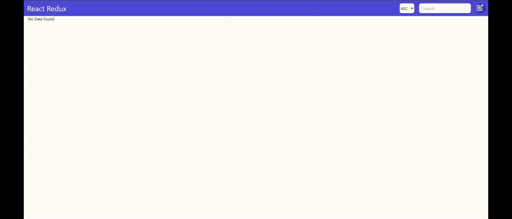

<!-- PROJECT LOGO -->
<br />
<div align="center" id="readme-top">
  <a href="https://github.com/sameteyuboglu/react-usestate-useref-axios-json-server">
    
  </a>

<h3 align="center">REACT Redux </h3>

  <p align="center">
    createSlice,useDispatch,useNavigate,useLocation,useSelector,useNavigate,React Router Dom
  </p>
</div>

## Başlangıç

React ile birlikte  createSlice,useDispatch,useNavigate,useLocation,useSelector,useNavigate,React Router Dom kullanımı için gerekli kurulumlar

### Kurulumlar

```sh
npm create vite@latest
```

```sh
npm i react-router-dom
```

```sh
npm install react-icons --save
```
```sh
npm install react-toolkit --save
```

```
```sh
npm install react-redux
```


```sh
npm i
npm run dev
```

<p align="right">(<a href="#readme-top">Başa Dön</a>)</p>


## Son Durum

